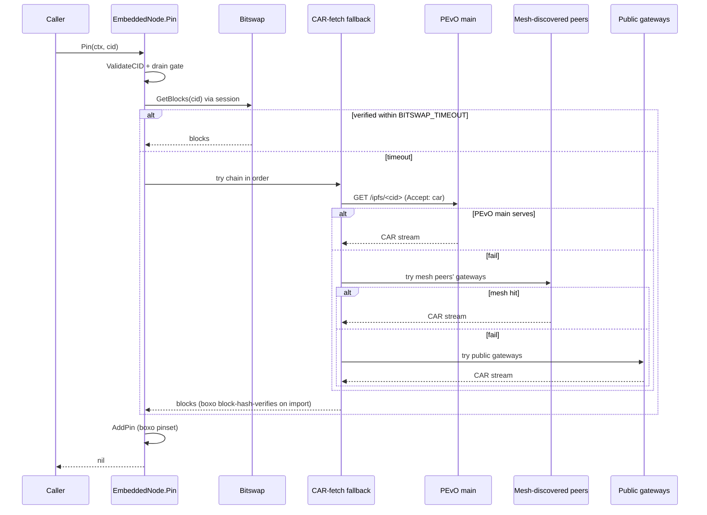

# PINNER-EMBEDDED-IPFS-NODE-VIA-BOXO — Restore the embedded-IPFS-node design intent

**Owner:** pinner
**Created:** 2026-05-21

## Context

The pinner was designed as a single Go executable that ships with an embedded IPFS node so third-party libraries and institutions can mirror PEvO content from one binary, no separate Kubo container or pinning-service account required. The current `pinner/ipfsnode.go` `EmbeddedNode` does not honor that design: it is an HTTP cache that fetches reassembled file bytes from public gateways (`ipfs.io`, `dweb.link`, `cloudflare-ipfs.com`, `gateway.pinata.cloud`) and writes them to `<dataDir>/blocks/<cid>` as a single file per CID. It does not participate in libp2p or bitswap, does not maintain a real blockstore, does not walk dag-pb DAGs, and has no trustless verification primitive available to it.

Three P0 hardening commits landed against the wrong layer:

- `a9091bc1 pinner(cid-validation-on-autopin-path)` — `ValidateCID` at autopin discovery + every backend entry. Independently useful; archived on its own merits.
- `7e2e0458 pinner(response-size-cap-on-gateway-fetch)` — `io.LimitedReader` cap on gateway reads. Defense-in-depth for the current HTTP-cache code; becomes moot once a real IPFS node is in place (boxo enforces its own per-block limits and trusts bitswap's block-level verification). Archived on its own merits.
- `28167cb6 pinner(content-hash-verify-on-pin)` — multihash-verify gateway body bytes against the CID. Verified empirically (2026-05-21) to reject 100% of real `ipfs add`-produced content: public gateways return reassembled UnixFS file bytes, whose sha2-256 does not equal the CID's multihash digest (which digests the dag-pb root block, not the file content). The test fixture `cidForContent` constructs synthetic CIDs as `cid.NewCidV0(mh.Sum(content, sha2-256))` — a shape `ipfs add` never produces — which made the test pass. Reverted as part of this task because non-functional verification is worse than no verification (false confidence). Task superseded by this one.

## Goal

Replace `EmbeddedNode` with a boxo-based in-process IPFS node. The pinner stays a single Go binary; the IPFS subsystem comes from `github.com/ipfs/boxo` (Kubo's components decomposed for embedding). Trustless verification, bitswap participation, dag-pb walking, and gateway serving are all handled by boxo libraries.

Concrete deliverables (high-level, to be refined via `/ce-brainstorm` when picked up):

1. A new `EmbeddedNode` backed by boxo's blockstore, libp2p host, bitswap, DHT, and HTTP gateway handler.
2. `Pin(cid)` fetches via bitswap (with optional trustless-gateway HTTP fallback using `Accept: application/vnd.ipld.car` so each block is hash-verified during import), stores blocks in the boxo blockstore, and updates `pins.json`.
3. `IsPinned(cid)` checks the boxo pin set.
4. `Unpin(cid)` removes the pin and lets GC reclaim blocks.
5. `/ipfs/<cid>` gateway serving handled by boxo's gateway handler so reassembled-file reads work correctly for any UnixFS DAG (multi-block files supported).
6. Existing `ValidateCID` guards stay at entry points (defense in depth; cheap).
7. Migration path for existing `<dataDir>/blocks/<cid>` files: either re-import on first start (preferred — boxo re-verifies during import) or document as a clean-slate transition (acceptable since beta has minimal user content).

## Non-goals

- Changing the Pinata mode. Unaffected.
- Changing the backend's Kubo container or upload path (`backend/src/routes/ipfs.ts`). PEvO's own upload-side is correct.
- Changing HAF discovery (`pinner/discovery.go`). Discovery feeds CIDs into the backend interface unchanged.
- Removing the `pinata` mode. Some third-party operators prefer it; it stays.
- A full design for libp2p config (NAT traversal, default ports, bootstrap nodes, peer-discovery policy). That's design work for the implementing pinner agent; brainstorm before coding.
- Performance optimization beyond what boxo provides out of the box. Single-instance PEvO traffic does not stress this layer.

## Acceptance

- `pinner/ipfsnode.go` `EmbeddedNode` participates in libp2p+bitswap (verified by a startup log line and an integration test that fetches a known CID from the public DHT).
- For a real `ipfs add`-produced CID, `Pin` fetches the content, every block is hash-verified, the resulting file is served correctly via `GET /ipfs/<cid>` on the pinner's gateway port.
- A unit/integration test exercises the multi-block file path (file >256 KiB) end-to-end and asserts the served bytes equal the original file. The prior single-block-only test fixture (`cidForContent` building `cid.NewCidV0(mh.Sum(content, sha2-256))`) is deleted or rewritten because it constructs synthetic CIDs that don't exist in the real ecosystem.
- Commit `28167cb6` is reverted as part of the rewrite (or its non-functional code removed during the rewrite). The replacement implementation provides trustless verification by construction (bitswap and CAR-import both verify block hashes during transfer).
- `ValidateCID` guards remain at `Pin/Unpin/IsPinned` entry points on both `EmbeddedNode` and `PinataBackend`.
- Single-binary deploy still holds: no separate Kubo container, no required external IPFS service. `docker run pinner` (or equivalent) is sufficient.
- The `IPFSBackend` interface docblock states its verification guarantee per implementation: `EmbeddedNode` (post-rewrite) verifies content via bitswap and CAR-import (block-level hash check by boxo); `PinataBackend` does not see bytes and trusts the Pinata service. `agents/pinner/CLAUDE.md` gains a short "Trust model" section formalizing the same divergence so operators picking `IPFS_MODE=pinata` understand the weaker guarantee. This closes the interface-contract ambiguity surfaced in the 2026-05-21 review (adversarial reviewer's `adv-7` Pinata vs EmbeddedNode hash-verify divergence).

## Implementation notes

Pinner agent: please run `/ce-brainstorm` before starting code work to refine the boxo dependency surface, libp2p config, blockstore choice (badger vs flatfs), gateway-fallback policy (whether to keep the HTTP gateway list as a CAR-fetch fallback for content missing from the DHT), and the migration story for existing `<dataDir>/blocks/<cid>` files. The architect-side synthesis that produced this task is captured in this file's Context + Goal sections; the prior failed approach in commit `28167cb6` is the cautionary anchor.

The reviews that surfaced the structural issue (audit `2026-04-21` + the architect's review of `28167cb6` on `2026-05-21`) treated three different symptoms — false-confidence verification, partial-file cleanup races, layering-order bugs — but the underlying disease is "EmbeddedNode pretends to be an IPFS node and is not." This task addresses the disease.

## Brainstorm decisions (2026-05-21)

Pinner brainstorm refined the five sub-decisions the Implementation notes flagged. Below is the scope the implementer should plan against; an implementation plan (file shape, dependency surface, test layout) is the next step via `/ce-plan` or direct `/ce-work` once the implementer is ready.

**Sequencing.** Single-shot replacement. No interim hash-verify revert; no parallel coexistence as a third `IPFS_MODE`. The current HTTP-cache `EmbeddedNode` is removed wholesale when boxo lands. Accepted cost: embedded mode stays broken against real `ipfs add`-produced CIDs until boxo ships; operators who need a working pinner in the interim use `IPFS_MODE=pinata`.

**Fetch path.** Bitswap is primary. On per-CID timeout (~60s default, tunable), fall back to a CAR-fetch chain (`Accept: application/vnd.ipld.car`) against a configurable list of trustless gateways. CAR import hash-verifies every block during transfer, so the fallback preserves the trustless trust model — no centralized-gateway trust is added.

**PEvO main as the network anchor.** PEvO main acts as **both** a trusted bootstrap libp2p peer (dialed directly on startup so bitswap always has at least one guaranteed provider for any PEvO CID) AND the first entry in the CAR-fetch fallback chain. Defaults ship pointing at PEvO main's known production endpoints; operators can override and add additional community-pinner peers and gateways for chained discovery.

**Community pinner mesh (auto-discovery).** Pinners advertise their presence on a libp2p pubsub topic namespaced per `APP_TAG` (so `pevo` and `pevotest` meshes stay separate). Heartbeats carry the pinner's libp2p peer ID and, optionally, its public gateway URL. Each pinner maintains a known-peers cache built from received heartbeats, dials those peers as additional bitswap providers, and chains their gateways into the CAR-fetch fallback list after PEvO main but ahead of generic public gateways. A community pinner that loses connectivity to PEvO main can still operate by routing through fellow pinners it has discovered. Heartbeat cadence, cache TTL, and an operator opt-out for the advertise side are tunable.

**Blockstore.** flatfs (Kubo default — one file per block in sharded directories). Simple, inspectable with `ls`, easy backups, no compaction surprises. Sufficient for projected PEvO scale (papers in the low thousands, each ~10–100 blocks). Badger is rejected as default.

**libp2p / NAT.** DHT **client** mode by default. The pinner queries the DHT and advertises its pinned content as a provider, but does NOT serve routing queries for the wider network — that's "good network citizen" work separable from the pinner's core job. NAT traversal is enabled aggressively (AutoNAT, UPnP / NAT-PMP, circuit relays) because **reachability**, not DHT mode, is the actual lever for offloading PEvO main when downloaders fetch content. Operators with public IPs can opt into server mode.

**Migration.** None. Pre-launch, no installed base. The boxo IPFS repo lives at a new path under `<dataDir>/`; any legacy `<dataDir>/blocks/` from tester machines is left alone (operator deletes by hand if they care).

**Gateway scope.** The pinner's public IPFS HTTP endpoint at `GATEWAY_PORT` serves only **pinned** content — no pull-through bitswap fetch for unpinned CIDs requested by external HTTP callers. Resource-control default; operators can opt in later if they want their pinner to act as a full public gateway.

**Pin state.** Boxo's pinset replaces (or wraps) the current `pins.json` — one less hand-rolled state file. The atomic-write helper introduced for `pins.json` / `autopin.json` is retained for autopin rule storage.

**Test fixtures.** The existing `cidForContent` synthetic-CID fixture is deleted or rewritten to derive real `ipfs add`-shape CIDs via boxo's UnixFS primitives. The fixture's reason for existing — making the structurally non-functional hash-verify pass in tests — disappears with the rewrite. Tests gated by build tag or env flag may exercise real DHT / bitswap; default `go test ./...` must remain offline-only.

**Configuration knobs.** New env vars surface for PEvO main's libp2p multiaddr, PEvO main's gateway URL, libp2p listen port, and an extra fallback-gateway list. Naming follows the bare-prefix convention used elsewhere in the pinner config set.

**Out of scope.** Two-step rollout (revert hash-verify first, boxo later); `IPFS_MODE=boxo` coexisting with HTTP-cache mode; badger blockstore; DHT server-mode default; pull-through public gateway; configurable chunker / block-size / CID-version; any change to Pinata mode; running a separate Kubo container or external IPFS service alongside the pinner binary.

## References

- Empirical verification of the multihash mismatch: architect review session 2026-05-21 (`git diff a9091bc1^..28167cb6` review; CIDs `QmPZ9g...`, `QmTudJ...`, `bafkrei...` curl + multihash compared).
- Original audit chunk that motivated the hash-verify task: `.context/audit-2026-04-21/chunk-6-correctness-reviewer.md`.
- Boxo: `github.com/ipfs/boxo` (Kubo libraries decomposed for embedding).
- Boxo gateway client (trustless CAR fetch): see boxo's `boxo/gateway/client` or its successor.

## Implementation plan (2026-05-21)

The brainstorm above settled the WHAT. This section captures the HOW: file shape, sequencing, dependencies, test layout. Eight implementation units (U1–U8) cover the rewrite end-to-end. Plan depth: Deep.

### Plan summary

Replace the current HTTP-cache `EmbeddedNode` with a boxo-backed in-process IPFS node. Single-shot replacement: no parallel `IPFS_MODE=boxo` coexistence with the HTTP-cache mode. The pinner stays a single static Go binary; everything from libp2p host to gateway handler is in-process. Eight ordered units gate on dependency: deps (U1) → libp2p host + DHT (U2) → blockstore + pinset (U3) → Pin via bitswap + CAR fallback (U4) → pubsub mesh (U5) → boxo gateway handler (U6) → lifecycle integration (U7) → test rewrite (U8).

### Output structure

New files land flat at the repo root, alongside existing `ipfsnode.go` (which is rewritten in place to top-level lifecycle):

```
ipfsnode.go              # top-level EmbeddedNode (lifecycle + IPFSBackend impl)
ipfsnode_libp2p.go       # host + DHT + NAT construction (U2)
ipfsnode_repo.go         # flatfs blockstore + boxo pinset (U3)
ipfsnode_fetch.go        # bitswap + CAR-fetch fallback chain (U4, U5 integration)
ipfsnode_pubsub.go       # community pinner mesh advertise + discover (U5)
ipfsnode_gateway.go      # boxo gateway HTTP handler (U6)
ipfsnode_integration_test.go  # //go:build integration end-to-end coverage (U8)
```

This shape is directional, not prescriptive — the implementer may collapse files if a smaller surface emerges. The per-unit `Files:` lists below remain authoritative for what each unit creates or modifies.

### High-level technical design

Pin's fetch chain on cache-miss (directional guidance for review, not implementation specification):



Trustless verification holds across every branch: bitswap and CAR-import both block-level hash-verify by construction. No centralized-gateway trust is added even when the fallback chain runs.

### Key technical decisions

| Decision | Choice | Rationale |
|---|---|---|
| Plan location | Append to this task file, not `docs/plans/` | Project convention per CLAUDE.md memory; brainstorm + plan live with the task they describe. |
| File split | Split `ipfsnode*.go` into 4–5 cohesive files | The current single file is already 456 lines; the rewrite easily doubles that. Splitting on responsibility (lifecycle / repo / fetch / pubsub / gateway) preserves grep-ability. |
| Boxo repo path | `<dataDir>/ipfs-repo/` (boxo flatfs convention) | Keeps boxo's expected layout intact; operator-inspectable with `ls`. |
| libp2p listen address | Random port (let libp2p pick) by default | Safest default for the common case (no public IP); operators with public IPs override via `LIBP2P_LISTEN`. |
| Pubsub topic format | `/pevo-pinners/<APP_TAG>/heartbeat/1.0.0` | libp2p protocol-versioning convention; `<APP_TAG>` separates `pevo` and `pevotest` meshes per brainstorm decision. |
| Default per-CID bitswap timeout | 60s | Brainstorm-stated default. Tunable via `BITSWAP_TIMEOUT`. |
| Default heartbeat cadence / cache TTL | 30s / 5min | Cache TTL > 10× cadence so one dropped heartbeat does not evict a healthy peer; cadence small enough that newly-online pinners are discovered within a minute. |
| Default tier-3 fallback gateways | `ipfs.io`, `dweb.link`, `cloudflare-ipfs.com`, `gateway.pinata.cloud` | Carry forward the existing `publicGateways` list as the final fallback after PEvO main and mesh peers. |
| Test gating mechanism | `//go:build integration` build tag | Go-idiomatic; default `go test ./...` stays offline; `go test -tags integration ./...` opts into network coverage. |
| pins.json migration | None (clean slate) | Brainstorm decision: pre-launch, no installed base. File left in place on disk for operator inspection if present. |

### Implementation units

#### U1. Add boxo + libp2p dependency surface

**Goal:** Pull in `github.com/ipfs/boxo` and the libp2p modules required by U2–U6 without removing anything else yet.

**Requirements:** Foundation for deliverables 1–5.

**Dependencies:** none.

**Files:** `go.mod`, `go.sum`.

**Approach:** `go get` boxo + libp2p at pinned versions (no `latest`). Verify the resulting binary remains static (no cgo introduced via transitive deps). Run `go mod tidy` to drop anything orphaned.

**Patterns to follow:** existing minimal-dependency posture in `go.mod` (`go-cid`, `go-multihash`, `lib/pq` only).

**Test scenarios:** none — pure dependency add. `go build` + `go vet` are the gates.

**Verification:** `go build ./...` produces a single static binary; `go mod tidy` is a no-op; `go list -deps -f '{{if .CgoFiles}}{{.ImportPath}}{{end}}' ./...` is empty.

#### U2. libp2p host + DHT + NAT lifecycle

**Goal:** Construct a libp2p host with DHT in client mode, AutoNAT/UPnP/NAT-PMP, and PEvO main as a default bootstrap peer. Wire host lifecycle into the `EmbeddedNode` struct.

**Requirements:** Brainstorm decisions on libp2p/NAT and PEvO main as anchor.

**Dependencies:** U1.

**Files:** `ipfsnode.go` (rewrite scaffold, replaces the current HTTP-cache struct fields), new `ipfsnode_libp2p.go`, `config.go` (new env vars `LIBP2P_LISTEN`, `PEVO_MAIN_LIBP2P_ADDR`).

**Approach:** libp2p host with TCP + QUIC transports, DHT client mode, AutoNAT + UPnP + NAT-PMP + circuit-relay client. Dial PEvO main multiaddr on startup as a non-blocking task; reconnect on disconnect via libp2p's connection manager. Boot failure on the bootstrap peer logs a warning but does NOT block startup — mesh discovery (U5) can substitute.

**Test scenarios:**
- Unit: host construction with default config produces a host with at least one TCP and one QUIC listener.
- Unit: bootstrap peer dial failure logs `[ipfs] bootstrap dial failed: <err>` and startup proceeds.
- Integration (`//go:build integration`): host dials PEvO main multiaddr and completes a bitswap handshake.

**Verification:** startup log shows `[ipfs] libp2p host started: <peer-id>` and listen multiaddrs; reachability state logged when AutoNAT resolves.

#### U3. Boxo blockstore + pinset on flatfs

**Goal:** Replace the current `<dataDir>/blocks/<cid>` flat-file scheme with boxo's flatfs-backed blockstore and pinset. Wire pinset into `IsPinned`, `PinnedCIDs`, and `Unpin`.

**Requirements:** Acceptance — deliverables 3 (IsPinned via boxo pin set) and 4 (Unpin + GC).

**Dependencies:** U1.

**Files:** `ipfsnode.go`, new `ipfsnode_repo.go`.

**Approach:** flatfs datastore at `<dataDir>/ipfs-repo/blocks/` (sharded directory layout — boxo default). Boxo pinset persisted alongside. `IsPinned` queries the pinset; `Unpin` removes from pinset and triggers blockstore GC. `PinnedCIDs` enumerates the pinset's union of recursive + direct pins. `ValidateCID` guard remains at every entry point per Acceptance deliverable 6.

**Test scenarios:**
- Unit: AddPin → IsPinned returns true; PinnedCIDs contains the CID.
- Unit: RemovePin → IsPinned returns false; subsequent GC pass reclaims the unreferenced blocks.
- Unit: PinnedCIDs across recursive + direct pin types deduplicates correctly.
- Unit: ValidateCID rejects malformed input before any boxo call.
- Unit: pinset state survives an in-process restart of the EmbeddedNode (open → close → open).

**Verification:** `<dataDir>/ipfs-repo/blocks/` populates with sharded block files (multiple directories under `.../blocks/`); pinset state survives `EmbeddedNode.Close` + reconstruct.

#### U4. EmbeddedNode.Pin via bitswap with CAR-fetch fallback chain

**Goal:** Replace the HTTP-cache Pin with a bitswap-primary fetch and a trustless CAR-fetch fallback chain on timeout.

**Requirements:** Acceptance — deliverable 2 (bitswap + trustless CAR fallback).

**Dependencies:** U1, U2, U3.

**Files:** `ipfsnode.go`, new `ipfsnode_fetch.go`.

**Execution note:** characterization-first — capture the current `EmbeddedNode.Pin` semantic contract (Drain gate check, `ErrPinnerShuttingDown` rejection, ValidateCID-first ordering) in tests before swapping the body, so the rewrite preserves IPFSBackend invariants. The fetch mechanism changes; the surrounding contract does not.

**Approach:** Pin walks the DAG via boxo's UnixFS + bitswap session. Per-CID timeout default 60s (`BITSWAP_TIMEOUT` env override). On timeout, the CAR-fetch fallback chain runs in order: PEvO main → community pinners (U5) → tier-3 public gateways. Each tier sends `Accept: application/vnd.ipld.car`; boxo's CAR import block-level-verifies every block. All chains exhausted → return error to caller. Existing drain-gate coordination (`drainMu`, `done`, `inFlight`, per-Pin cancels) is preserved in shape: replace the HTTP-loop body, keep the gating; cancels apply to the bitswap session + CAR-fetch HTTP requests.

**Patterns to follow:** the existing drain-gate scaffolding in current `EmbeddedNode.Pin` — the rewrite reuses the shape, only the fetch mechanism changes.

**Test scenarios:**
- Unit: malformed CID rejected by `ValidateCID` before any network activity.
- Unit: Pin called after Drain returns `ErrPinnerShuttingDown`.
- Unit: Pin's in-flight cancel propagates into the bitswap session and the CAR-fetch HTTP request on force-cancel.
- Integration (`//go:build integration`): real `ipfs add`-shape CID is fetched via bitswap from PEvO main and verified locally.
- Integration: multi-block file (>256 KiB) is fetched and assembled correctly; block count in `<dataDir>/ipfs-repo/blocks/` matches expectations.
- Integration: bitswap timeout (configurable to ~100 ms for the test) → CAR fallback activates and lands the content.
- Integration: hostile CAR-fetch server returning bytes whose hash does not match the requested CID is rejected at boxo's CAR-import boundary; no partial block lands.

**Verification:** an `ipfs add`-shape CID known to be served by PEvO main is pinned end-to-end; `<dataDir>/ipfs-repo/blocks/` shows the expected sharded block files.

#### U5. Community pinner pubsub mesh advertise + discovery

**Goal:** Pinners advertise on a libp2p pubsub topic per `APP_TAG`; received heartbeats populate a known-peers cache that feeds bitswap providers and the CAR-fetch fallback chain.

**Requirements:** Brainstorm decision on community pinner mesh auto-discovery.

**Dependencies:** U2.

**Files:** new `ipfsnode_pubsub.go`, `config.go` (new env vars `MESH_HEARTBEAT_INTERVAL`, `MESH_CACHE_TTL`, `MESH_ADVERTISE_DISABLED`).

**Approach:** Topic = `/pevo-pinners/<APP_TAG>/heartbeat/1.0.0`. Heartbeat payload: pinner peer ID, libp2p multiaddrs, optional public gateway URL. Cadence default 30s; cache TTL default 5min. On receive: dial sender as a bitswap peer; insert gateway URL (if any) into the CAR-fetch fallback chain ahead of public gateways, behind PEvO main. `MESH_ADVERTISE_DISABLED=1` switches the pinner to subscribe-only (still consumes the mesh but does not publish heartbeats).

**Test scenarios:**
- Unit: heartbeat payload round-trips through serialize → deserialize.
- Unit: stale heartbeats (older than `MESH_CACHE_TTL`) are evicted from the known-peers cache.
- Unit: `MESH_ADVERTISE_DISABLED=1` suppresses publish but not subscribe.
- Unit: fallback chain insertion order is deterministic (PEvO main first, mesh entries by heartbeat receipt time, public gateways last).
- Integration (`//go:build integration`): two pinners on the same `APP_TAG` topic discover each other within one heartbeat interval; an `APP_TAG` mismatch isolates them (cross-talk-free).

**Verification:** startup log line `[ipfs] mesh subscribed to <topic>`; on heartbeat receipt `[ipfs] mesh discovered pinner <peer-id> (gateway=<url-or-none>)`.

#### U6. Boxo HTTP gateway handler (pinned-only)

**Goal:** Replace `handleGateway` with boxo's gateway handler, serving only locally-pinned content. Multi-block UnixFS files served end-to-end.

**Requirements:** Acceptance — deliverable 5 (boxo gateway serves any UnixFS DAG).

**Dependencies:** U3.

**Files:** `ipfsnode.go`, new `ipfsnode_gateway.go`. Also updates `server.go` handler `handleIPFSProxy` so the type-assert dispatch still works (or simplifies once the embedded path is uniform).

**Approach:** boxo's `gateway.Handler` wired to a blockstore-only backend — explicitly NO pull-through bitswap fetch for unpinned CIDs requested via HTTP (resource-control default per brainstorm). Path-style only (`/ipfs/<cid>`); subdomain gateway out of scope. `ValidateCID` guard remains at route entry.

**Test scenarios:**
- Unit: `GET /ipfs/<pinned-cid>` returns 200 with the correct bytes.
- Unit: `GET /ipfs/<unpinned-cid>` returns 404 (no pull-through fetch).
- Unit: malformed CID in path returns 400 (ValidateCID rejects before reaching boxo).
- Unit: multi-block UnixFS file (>256 KiB) is served correctly end-to-end — the prior single-file handler could not do this.
- Unit: `Range` header honored for partial reads (boxo gateway handler supports this out of the box; verify it survives the integration).

**Verification:** `curl http://localhost:8080/ipfs/<pinned-multi-block-cid>` returns the full file; `Content-Length` matches.

#### U7. Lifecycle integration — Drain/Close, config knobs, startup logging

**Goal:** Integrate the boxo node into the existing Drain/Close shutdown sequence and surface every new operator-tunable knob.

**Requirements:** Acceptance — deliverable 7 (migration path documented as clean-slate); preservation of single-binary deploy.

**Dependencies:** U2, U3, U4, U5, U6.

**Files:** `ipfsnode.go`, `config.go`, `main.go`, `.env.example`.

**Approach:** New env vars (bare-prefix convention): `LIBP2P_LISTEN`, `PEVO_MAIN_LIBP2P_ADDR`, `PEVO_MAIN_GATEWAY_URL`, `FALLBACK_GATEWAYS` (comma-separated), `BITSWAP_TIMEOUT`, `MESH_HEARTBEAT_INTERVAL`, `MESH_CACHE_TTL`, `MESH_ADVERTISE_DISABLED`. Defaults documented in `.env.example`. `Drain` order: stop accepting new Pin calls (existing gate) → cancel in-flight bitswap sessions + CAR-fetch requests → wait `inFlight.Wait()` → tear down pubsub subscriptions. `Close` shuts down the libp2p host + gateway server + datastore. Existing `ErrPinnerShuttingDown` contract preserved. Startup log gains one line per new knob alongside the existing `AUTOPIN_*` lines.

**Test scenarios:**
- Unit: missing `PEVO_MAIN_LIBP2P_ADDR` logs a warning and startup continues.
- Unit: invalid `FALLBACK_GATEWAYS` entry surfaces a clear error at startup, not a runtime panic.
- Unit: `Drain(ctx)` with a hung in-flight bitswap session and a deadline returns `ctx.Err()` after force-cancel — same contract as the current `EmbeddedNode.Drain`.
- Integration (`//go:build integration`): graceful shutdown drains an in-flight bitswap session within the configured grace window.

**Verification:** startup log shows every new env-var value and chosen default; existing `/api/status` extension (from the autopin task) optionally surfaces relevant ones if useful.

#### U8. Test fixture rewrite — real UnixFS CIDs, build-tag gate

**Goal:** Delete the synthetic `cidForContent` fixture and rewrite tests to use real UnixFS-derived CIDs via boxo's UnixFS primitives. Gate DHT / bitswap / network-dependent tests behind `//go:build integration` so default `go test ./...` stays offline-only.

**Requirements:** Acceptance — deliverable 3 sub-clause ("the prior single-block-only test fixture is deleted or rewritten"); brainstorm decision on test fixtures.

**Dependencies:** U1, U3, U4, U6.

**Files:** `contenthash_test.go` (delete — the hash-verify code it tested is removed in U4), `shutdown_test.go` (rewrite to use boxo's drain primitives + UnixFS-derived CIDs), `sizecap_test.go` (delete or rewrite — boxo enforces block-level limits internally; the per-CID size cap may need a different shape or move into the CAR-fetch fallback path), new `ipfsnode_integration_test.go` for end-to-end coverage.

**Approach:** Build CIDs by chunking content through boxo's UnixFS importer, so the resulting CID is what `ipfs add` would produce. For unit-level pin / IsPinned / Unpin tests, this means real CIDs over an in-memory blockstore — no network required. For end-to-end coverage (bitswap from PEvO main, CAR-fetch fallback chain, pubsub mesh between two pinners), gate behind `//go:build integration`. Drop the multi-gateway-loop tests outright; they no longer apply.

**Patterns to follow:** existing `t.TempDir()` + `t.Cleanup(...)` + `httptest.NewServer` patterns are reusable for CAR-fetch fallback fakes.

**Test scenarios:** the rewrite of each existing test file; this unit's test scenarios are the test scenarios from U2–U7 collectively, plus the deletions.

**Verification:** `go test ./...` (no tags) runs offline-only, completes under 5s, all tests pass; `go test -tags integration ./...` runs the network-dependent suite when CI grants egress and passes against PEvO main.

### Scope boundaries

**Active in this plan:** U1–U8 above.

**Deferred to follow-up work** (planned, but separate tasks):
- Subdomain gateway support (`<cid>.ipfs.example.com`).
- DHT server-mode opt-in env knob — the brainstorm noted server mode as an operator opt-in; the knob can land as a follow-on task once the client-mode default is proven.
- `/api/status` extension to expose libp2p peer ID, reachability state, and mesh-peer count.

**Outside this product's identity** (brainstorm "Out of scope" — restated for the plan reader):
- Two-step rollout (revert hash-verify first, boxo later).
- `IPFS_MODE=boxo` coexisting with HTTP-cache mode as a third backend.
- Badger blockstore (flatfs is the choice).
- DHT server-mode default (client mode is the choice).
- Pull-through public gateway (pinned-only is the choice).
- Configurable chunker / block-size / CID-version.
- Any change to Pinata mode.
- Running a separate Kubo container or external IPFS service alongside the pinner binary.

### Risks + mitigations

- **Dependency surface bloat.** Boxo + libp2p pulls a wide transitive graph; cgo may sneak in via a transitive. Mitigate at U1 by gating on `go list -deps -f '{{if .CgoFiles}}{{.ImportPath}}{{end}}' ./...` empty. If a transitive does introduce cgo, evaluate alternatives or accept and document.
- **NAT / connectivity in CI.** libp2p NAT traversal silently fails in CI environments without network egress. Mitigate via `//go:build integration` gate on every network-touching test (U8).
- **Pubsub mesh has low signal at launch.** With only PEvO main and a handful of pinners, the mesh is mostly empty. Mitigate by treating mesh as additive — bitswap via PEvO main as bootstrap delivers content from day one; mesh discovery is value-add.
- **Boxo API drift.** Boxo is pre-1.0 at the time of writing; minor versions may break APIs. Mitigate by pinning the exact version in `go.mod` and gating upgrades behind a dedicated task.
- **Embedded-mode broken for `ipfs add` content until U4 lands.** Per brainstorm sequencing: single-shot replacement leaves embedded mode non-functional against real `ipfs add` CIDs in the interim. Mitigate by communicating operator guidance to use `IPFS_MODE=pinata` for the bridge period; document in README on the implementing branch before merge.

### Test strategy

- **Default offline-only:** `go test ./...` runs unit tests against in-memory blockstores + UnixFS-derived CIDs. Fast, deterministic, no network.
- **Network-dependent suite:** `go test -tags integration ./...` runs end-to-end tests against PEvO main and a paired in-process pinner for mesh coverage. Gated by `//go:build integration` build tag.
- **Build-tag is the single gate:** no `if testing.Short()` or env-var skips; one mechanism.
- **Race-detector clean:** `go test -race ./...` passes on the offline suite. The integration suite may have race-detector noise from libp2p internals; if so, document and isolate.

### Implementation-time unknowns

Resolved during execution, not here:

- Exact boxo subpackage import paths (the library is decomposed into many modules; the implementer picks the right ones once they sit with the code).
- The precise shape of `EmbeddedNode`'s field set after the rewrite (the brainstorm-stable parts — drain coordination, ValidateCID guards, lifecycle methods — remain; the fetch internals are replaced wholesale).
- Whether the boxo gateway handler exposes a hook for the `ValidateCID` pre-check at the right layer, or whether the existing route-level guard is the cleaner place.
- The pubsub heartbeat payload encoding (protobuf vs JSON vs raw CBOR) — the implementer picks once the boxo / libp2p version is pinned.
